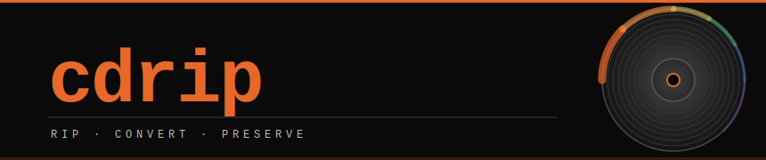

<div align="center">
  
</div>

<div align="center">

[](https://www.rust-lang.org)
[](https://github.com/DonovanMontoya/CD-Rip/releases)
[](https://github.com/DonovanMontoya/CD-Rip/releases)


</div>

<br>

`cdrip` is a minimal Rust CLI that locates mounted CD volumes, rips AIFF audio tracks, and converts them to lossless FLAC — powered by `ffmpeg`.

---

## Install

**Homebrew** *(macOS)*

```sh
brew tap DonovanMontoya/ipod-tools
brew install cdrip
```

**Cargo**

```sh
cargo install --git https://github.com/DonovanMontoya/CD-Rip
```

<details>
<summary>Build from source</summary>
<br>

```sh
git clone https://github.com/DonovanMontoya/CD-Rip.git
cd CD-Rip
cargo build --release
./target/release/cdrip --help
```

</details>

Pre-built binaries for macOS, Linux, and Windows are on the [releases page](https://github.com/DonovanMontoya/CD-Rip/releases).

---

## Requirements

[ffmpeg](https://ffmpeg.org/) must be installed and on your `PATH` for FLAC conversion.

```sh
brew install ffmpeg        # macOS
apt  install ffmpeg        # Debian / Ubuntu
```

---

## Commands

### `view` — list detected CD volumes

Scans your system for mounted volumes containing AIFF audio files.

```sh
$ cdrip view
/Volumes/MY_ALBUM
```

---

### `rip` — rip audio from a mounted CD

Copies or converts AIFF files directly from a detected CD volume.

```sh
cdrip rip [OUTPUT] [--convert] [--delete]
```

```
  OUTPUT            destination directory     (default: CD volume path)
  -c, --convert     convert output to FLAC    (default: copy as AIFF)
  -d, --delete      remove source files from disc after rip
```

```sh
# Copy AIFF files to ~/Desktop/MyAlbum
$ cdrip rip ~/Desktop/MyAlbum

# Rip and convert directly to FLAC, delete originals from disc
$ cdrip rip ~/Music/MyAlbum --convert --delete
```

> When multiple CDs are detected, `cdrip` prompts you to select one.

---

### `makeflac` — convert AIFF files to FLAC

Batch-converts all AIFF files in a directory to lossless FLAC.  
Auto-detects a mounted CD if no path is provided.

```sh
cdrip makeflac [PATH] [OUTPUT] [--delete]
```

```
  PATH              source directory          (auto-detects CD if omitted)
  OUTPUT            output directory          (defaults to PATH)
  -d, --delete      delete originals after conversion
```

```sh
# Convert all AIFFs in the current directory
$ cdrip makeflac .

# Separate input/output, clean up source files
$ cdrip makeflac ~/Music/Raw ~/Music/FLAC --delete
```

---

## Platform Support

| Platform | Volume Detection Paths                             |
|----------|---------------------------------------------------|
| macOS    | `/Volumes`                                        |
| Linux    | `/mnt` &nbsp;·&nbsp; `/media/*` &nbsp;·&nbsp; `/run/media/*` |
